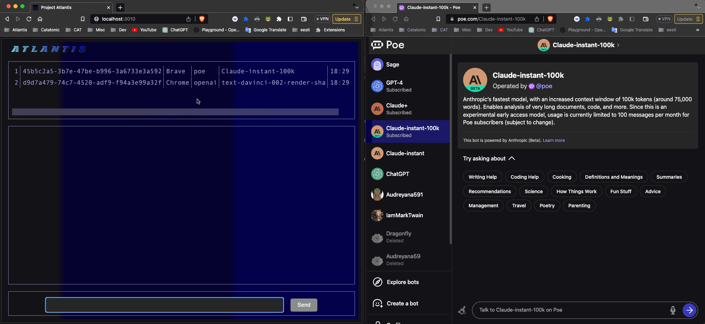

# llmservice

Not for commercial use!

This service connects Python clients to browsers using ChatGPT Poe etc. This is meant to be used in conjunction with the browser extension

Exposes HTTP endpoint /llm on port 3010 for use by a client (see Python llmwrapper) to submit LLM requests by service name and model name (see web page below)

This serves an admin web page on port 3010 that shows which extensions are connected (and exposes socket.io surface for use by the monitoring page)

# Some fine print

Wait - tsc -w generates a ton of errors because no classes found. And what's the TypeBuilder.js class generation crap in package.json and what classes are being generated to src/types ?

This is automatic TS class generation from the early days of Flow/Typescript classes. This code was pulled from a lot of older projects which rely heavily on the 'self' idiom (which is what TS classes transpile to under the covers). Yeah this probably needs to be convertd to straight TS classes. My main reason for doing so was that self lets you play games w closures that you really easily do with legit TS classes (instead you end up w a zillion attributes in the class and no clear dependency order of initialization logic)

This is mostly an interim solution for running demos etc until real API access is obtained - chatbot-ui offers a much better UX this is mainly for exposing API-ish endpoints